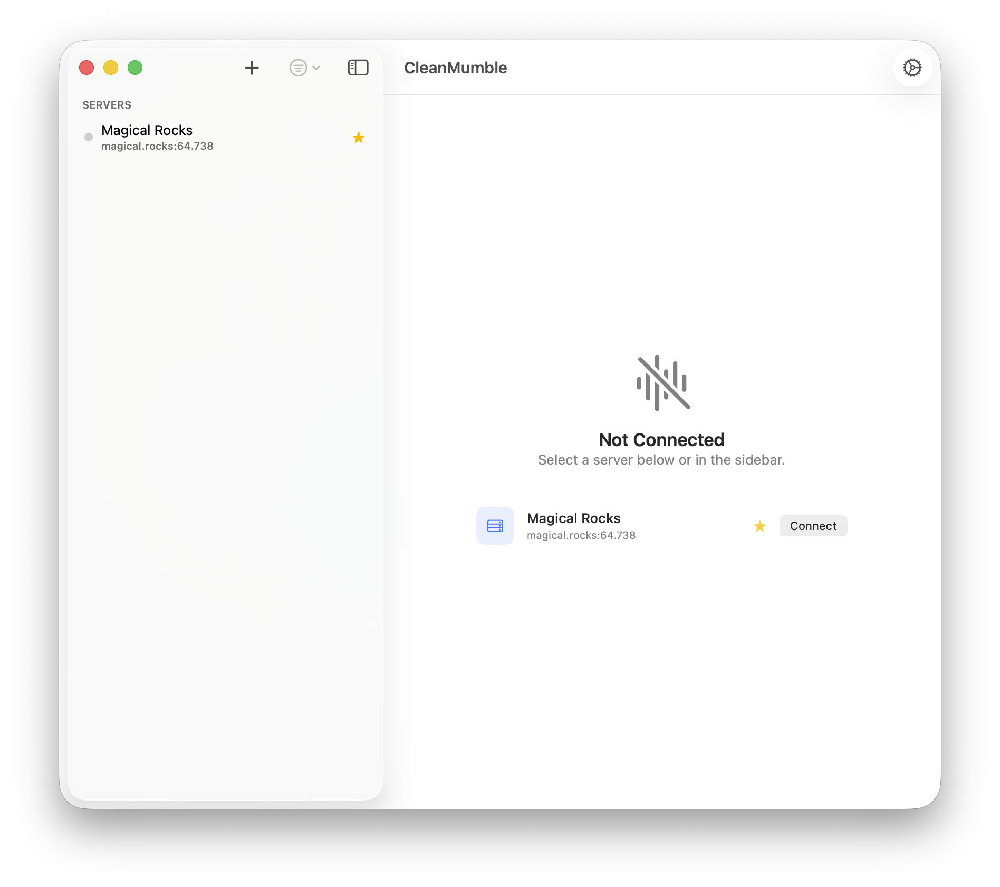
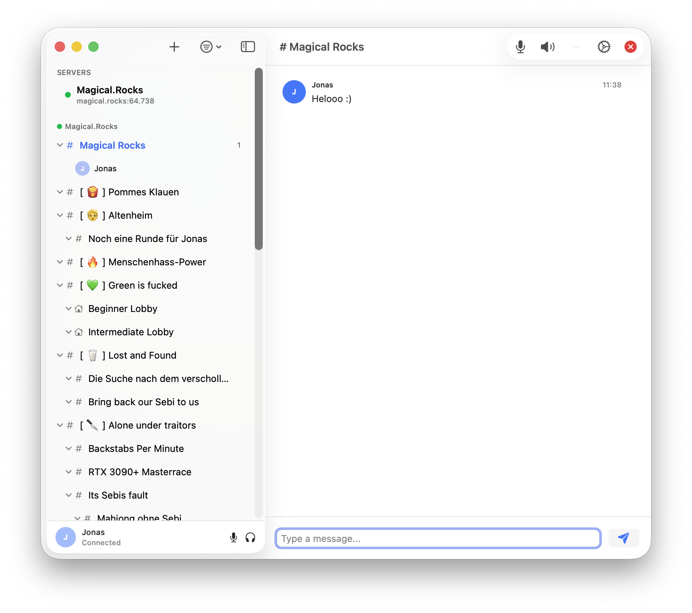
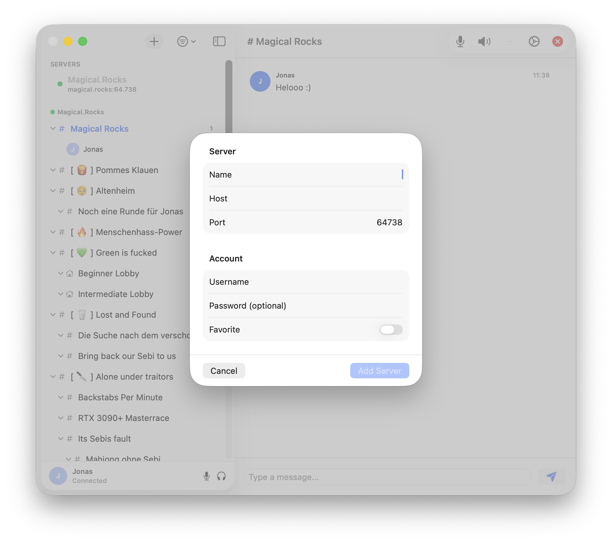
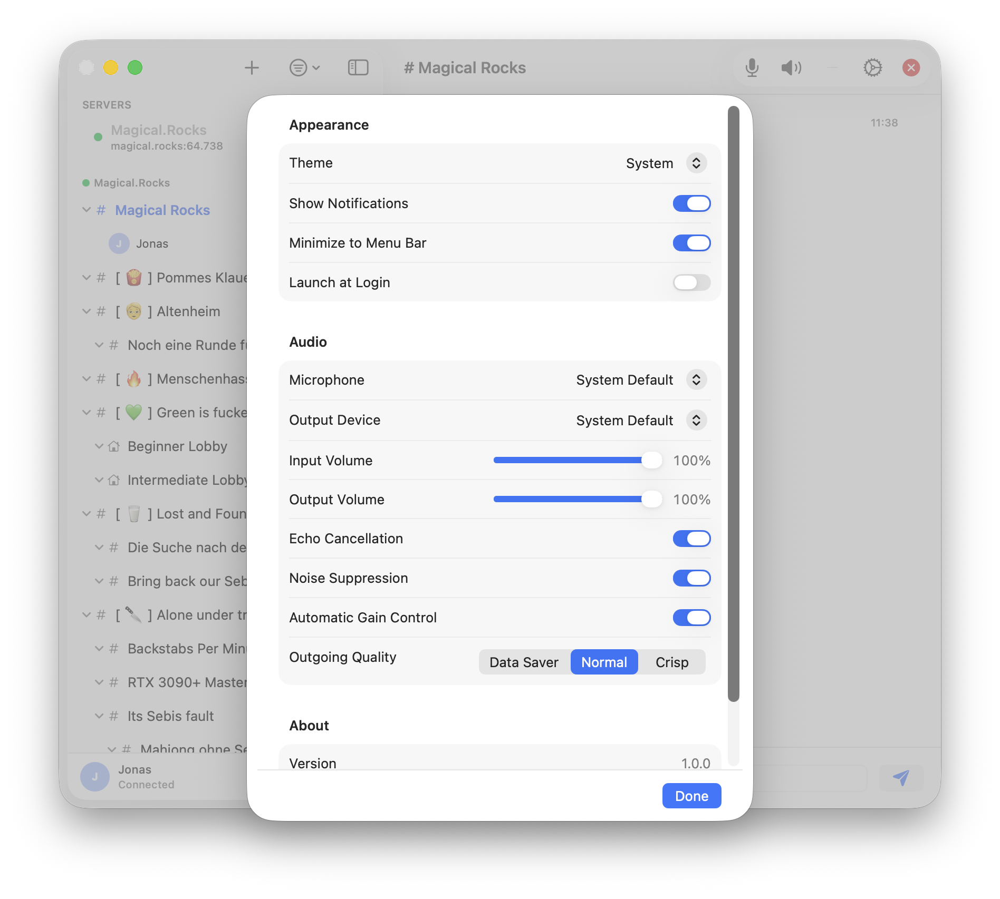

# CleanMumble

A clean, native Mumble client for macOS — built with SwiftUI.


> **App Store review pending.** iPad and iOS support coming soon.

---

## Screenshots

| | |
|---|---|
|  |  |
|  |  |

---

## Features

- **Native macOS UI** — Discord-style sidebar with server list, channel tree, and user presence
- **Full Mumble protocol** — TLS, protobuf messaging, UDPTunnel audio
- **Opus audio** — High-quality voice with selectable quality presets
- **Audio quality presets** — Data Saver · Normal · Crisp (16 / 40 / 96 kbps)
- **Audio device selection** — Choose microphone and output device independently
- **Channel joining** — Browse and join channels with a double-click
- **Mute & deafen** — Controls always visible in the sidebar strip
- **Text chat** — Per-channel text messaging
- **Quick connect** — Saved servers on the home screen for one-click connecting
- **Settings** — Appearance themes, audio processing toggles (echo cancellation, noise suppression, AGC)

---

## Requirements

- macOS 14 Sonoma or later
- Apple Silicon or Intel Mac

---

## Building from Source

1. Clone the repository:
   ```bash
   git clone https://github.com/jonasgunklach/CleanMumble.git
   cd CleanMumble
   ```

2. Open in Xcode:
   ```bash
   open CleanMumble.xcodeproj
   ```

3. Select the **CleanMumble** scheme, choose your Mac as destination, press **⌘R**.

> Xcode 16 or later recommended. Swift Package Manager dependencies resolve automatically on first build.

---

## Dependencies

| Package | Purpose |
|---|---|
| [swift-opus](https://github.com/mkrd/swift-opus) | Opus audio codec (encode/decode) |

---

## Roadmap

- [ ] iPad support
- [ ] iPhone support
- [ ] Push-to-talk key binding
- [ ] Notification for mentions and channel events
- [ ] Server-side user avatars

---

## License

MIT License — see [LICENSE](LICENSE) for details.

---

*Developed by [Jonas Gunklach](https://github.com/jonasgunklach)*
